## vue源码

下载源码保存到vue3.js，https://unpkg.com/vue@3/dist/vue.global.js

html中本地引入

```
<!DOCTYPE html>
<html lang="en">
<head>
    <meta charset="UTF-8">
    <meta name="viewport" content="width=device-width, initial-scale=1.0">
    <title>Document</title>
    <script src="./vue3.js"></script>
</head>
<body>


<div id = 'counter'>
    <!-- 如何让vue中解析的数据和dom有关联 -->
    <!-- 使用数据：加{{}} ,
        告诉vue{{}}中放了一个变量，在解析的配置对象中
    找这个变量-->
    <p>{{num}}</p>
    <p>{{name}}</p>
    <p>{{name2}}</p>
<!-- 变量名字需要和配置中相同 -->
</div>

    <script>
        //vue设计对象中的data属性返回数据
        const Counter = {//配置对象data属性固定
            data:function(){
                return {
                    num:0,
                    name:"test"
                }
            },
        };
        //源码声明的Vue对象
        const test = Vue.createApp(Counter);//创建一个应用，传入配置对象
        //自动解析配置对象
        test.mount('#counter');//挂载,div中写id，挂载到这里


    </script>
</body>
</html>
```

vue实现不手动处理dom来进行数据和dom的关联

```
  let app = test.mount('#counter');//挂载,div中写id，挂载到这里
        console.log(app);//其中代理了Counter中的data属性

```

app.num修改则页面自动修改

数据的双向绑定：

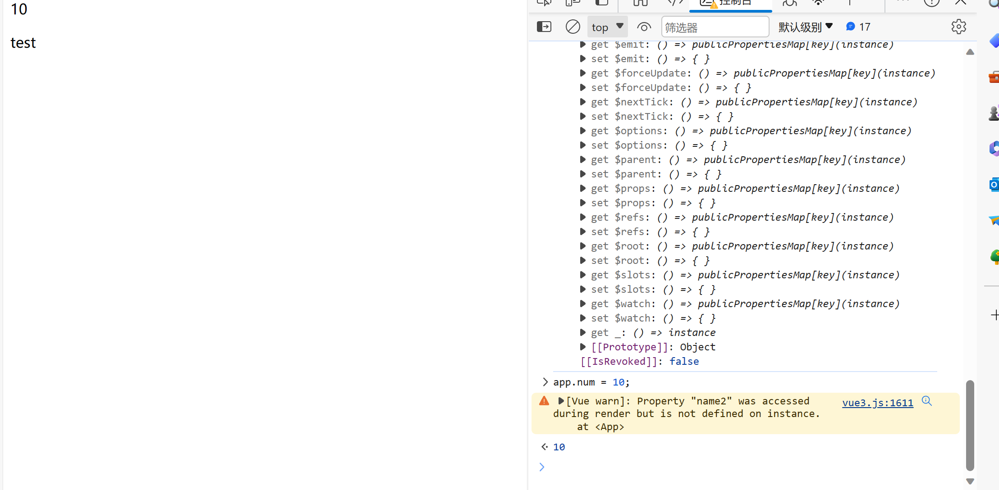

## 使用vite构建项目(快速编译)

`npm init vite@latest vue-begin01 -- --template vue`

cd vue-begin01

npm install

npm run dev

文件结构：
node_modules:存储扩展和包

assets：静态资源

main.js:入口文件

挂载是是app元素：
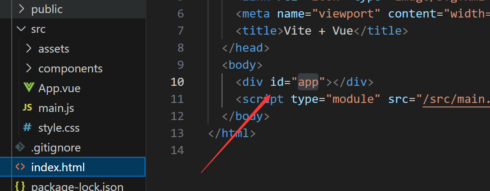

**将vue组件内的内容挂载到id = 'app'上**

所有东西都是响应式的

## 根组件+挂载

[创建一个 Vue 应用 | Vue.js (vuejs.org)](https://cn.vuejs.org/guide/essentials/application.html)

```
<div id="app"></div>
```

```
app.mount('#app')
```

## v-指令

### v-once v-html

仅渲染元素和组件一次，并跳过之后的更新。

在随后的重新渲染，元素/组件及其所有子项将被当作静态内容并跳过渲染。这可以用来优化更新时的性能。

```
//声明式渲染 vue2的写法，使得数据可以在template中使用
export default{
  data(){
    return{
      name:"test",
      num:0,
      message:"<h2>message</h2>"
    }
  },
  methods:{
    changeName:function(){
      this.name = 'user';
    }
  }
}
</script>

<template>
  {{ name }}
  {{ num }}
  <div>
    
    <span v-once>{{ name }}</span>
    <!-- 点击改变名字v-once修饰的地方不会更新 -->
    <button @click="changeName">改变名字</button>
  
    <!-- {{  }}展示html代码需要特殊处理 -->
  <p v-html="message"></p>
  </div>
</template>
```

## v-bind

v-bind也可以直接用:来省略

动态绑定id，src等来修改元素

[模板语法 | Vue.js (vuejs.org)](https://cn.vuejs.org/guide/essentials/template-syntax.html#using-javascript-expressions)

## v-on 用于监听DOM事件

```


  <!-- v-bind动态绑定属性内容 -->
  <!-- <p v-bind:id = "id">v-bind</p>
  
  <p :id="id">v-bind</p> -->


  <!-- 用函数 -->
  <!-- <button @click="change">改变颜色1</button> -->
  <!-- 用js表达式 -->
<!-- <button @click="id='id2'">改变颜色2</button>
<p>{{ num+=1 }}</p>
<p>{{ name.split('').reverse().join('') }}</p> -->

<button v-on="click"></button>
<!-- v-on语法糖：@ -->

```

v-bind动态事件

```vue

  <!-- 用函数 -->
  <!-- <button @click="change">改变颜色1</button> -->
  <!-- 用js表达式 -->
<!-- <button @click="id='id2'">改变颜色2</button>
<p>{{ num+=1 }}</p>
<p>{{ name.split('').reverse().join('') }}</p> -->

<button v-on="click"></button>
<!-- v-on语法糖：@ -->


<!-- 动态参数 -->
<!-- 动态属性 -->
<p v-bind:[att]= "id">v-bind</p>

```


## data property和methods

使用null，undefined等占位符
定义methods时尽量避免使用箭头函数，防止不恰当的绑定this指向


## 计算属性(缓存：用于提高性能)

调用时直接使用

更改此应用的 `data` 中 `books` 数组的值后，可以看到 `publishedBooksMessage` 也会随之改变。

在模板中使用计算属性的方式和一般的属性并无二致。Vue 会检测到 `this.publishedBooksMessage` 依赖于 `this.author.books`，所以当 `this.author.books` 改变时，任何依赖于 `this.publishedBooksMessage` 的绑定都将同时更新

直接使用{{}}里一个函数也能实现同样的效果

但是：**计算属性值会基于其响应式依赖被缓存**。一个计算属性仅会在其响应式依赖更新时才重新计算。这意味着只要 `author.books` 不改变，无论多少次访问 `publishedBooksMessage` 都会立即返回先前的计算结果，而不用重复执行 getter 函数

 `Date.now()` 并不是一个响应式依赖：

所以不会更新：

```javascript
computed: {
  now() {
    return Date.now()
  }
}
```

### Setter，Getter

计算属性的完整写法，默认只有get

```javascript
export default {
  data() {
    return {
      firstName: 'John',
      lastName: 'Doe'
    }
  },
  computed: {
    fullName: {
      // getter
      get() {
        return this.firstName + ' ' + this.lastName
      },
      // setter
      set(newValue) {
        // 注意：我们这里使用的是解构赋值语法
        [this.firstName, this.lastName] = newValue.split(' ')
      }
    }
  }
}
```

```
computed:{
    reverseMsg:{
        get(){
        return this.message.split('').reverse().join('');
    },
        set(newvalue){
            this.message = newvalue;
    }
    }  
    
    },
    now() {
    return Date.now()
  }
<!-- 自动调用set函数 -->
    <button @click="reverseMsg='你好'">改变reverseMsg</button>

```

## 侦听器watch

```
   watch:{//监听数据的变化,message改变则执行对应的函数
        message:{
            immediate:true,//初始化就调用监听函数
            handler:function(newvalue,oldValue){
                console.log("new",newvalue);
            console.log(oldValue);
            //执行异步操作，或复杂的逻辑
//一个数据影响多个数据
            if(newvalue.length<5||newvalue.length>10){
                console.log("输入框内容长度不能小于5或大于10");
            }
            }

           
        }
        
    }
```

简写可以直接跟函数

```
 <!-- 数据双向绑定 -->
<input type="text" v-model="message">
```

### 对象的深度监听

普通监听不到对象中的属性变化

```

 user:function(newvalue){
            console.log(newvalue);
            console.log(newvalue.name);
        }

<p>{{ user.name }}</p>

<button @click="user.name='newuser'">改变名字</button>


```

#### 深度监听，使用watch的属性deep

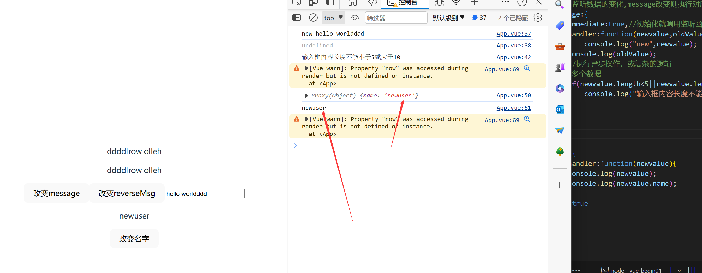

```javascript
 // user:{
        //     handler:function(newvalue){
        //     console.log(newvalue);
        //     console.log(newvalue.name);
        // },
        // deep:true//一层层向下遍历

        // }
        //如何只监听user.name:使用字符串优化
        "user.name":{
            handler:function(newvalue){
            console.log(newvalue);//直接侦听到了name属性
            console.log(newvalue.name);
        },
        deep:true//一层层向下遍历

        }
        
```


## class和style动态绑定

```javascript
<script>

//声明式渲染 vue2的写法，使得数据可以在template中使用
export default {
    data() {
        return {
            message: "hello worldddd",
            user: {
                name: "user1",
                age: 18,

            },
            isActive: true,
        }
    },
    methods: {


    }
}

</script>

<template>
    <div>
        <!-- 1.普通使用class的方式 :放置字符串-->
        <p class="active">hello</p>
        <!-- 2.放置对象 -->
        <p :class="{ active: isActive, h: isActive }">hello1</p>
        <p :class="{ active: false }">hello1</p>
        <button @click="isActive = !isActive">改变isActive</button>
    </div>
</template>

<style scoped>
.active {
    font-size: 50px;
    color: blue;
}

.h {
    background-color: aqua;
}
</style>

```

**这样就可以通过控制isActive**来控制控件绑定的样式
原有class不会被覆盖：

```html
   <p :class="{ active: false }" class="hello2">hello1</p>
```

```
            activeList:{active:true,h:true}

<!-- 用对象形式 -->
        <p :class="activeList">hello1</p>
```

### 结合计算属性

```
 <!-- 使用计算属性 -->
 
 computed:{
        classChange:function(){
            return {
                active:this.isActive&&!this.error,
                h:this.error
            }
        }
    }
        <div :class="classChange">test</div>
```

### 数组语法

```javascript
     
                 message: "h",

     <!-- 数组语法不常用 -->
        <div :class="[message]">test</div>

        <!-- 数组+对象 -->
        <div :class="[message,{active:isActive}]">test</div>

```

## 内联样式

```javascript
<script>
export default {
    data() {
        return {
            activeColor:"red",
            fontsize:30,
            bgc:"red",
            styob:{
                color:'red',
                fontSize:'50'+'px',
                'background-color':'red'
            }
        }
    },
}
</script>
<template>
    <div>
        <!-- 绑定内联样式1.使用字符串 -->
        <p style="color: blueviolet;">hello</p>
        <!-- 2.放置对象 font-size这种有-要改成fontSize
        或是加引号-->
        <p :style="{color:activeColor,fontSize:fontsize+'px'}">hello</p>
        <p :style="{color:activeColor,fontSize:fontsize+'px','background-color':bgc}">hello</p>
        <!--3. 样式抽取出来放入data -->
        <p :style="styob">hello</p>
        <!-- 4.结合计算属性 -->
        <!-- 5.数组语法 -->
        <p :style="[styob,{border:'5px solid blue'}]">array</p>
 </div>
</template>

```

## 条件渲染v-if，v-show

`v-if` 指令用于条件性地渲染一块内容。这块内容只会在指令的表达式返回真值时才被渲染。

`v-if` 是“真实的”按条件渲染，因为它确保了在切换时，条件区块内的事件监听器和子组件都会被销毁与重建。

`v-if` 也是**惰性**的：如果在初次渲染时条件值为 false，则不会做任何事。条件区块只有当条件首次变为 true 时才被渲染。

相比之下，`v-show` 简单许多，元素无论初始条件如何，始终会被渲染，只有 CSS `display` 属性会被切换。

总的来说，`v-if` 有更高的切换开销，而 `v-show` 有更高的初始渲染开销。因此，如果需要频繁切换，则使用 `v-show` 较好；如果在运行时绑定条件很少改变，则 `v-if` 会更合适。

```javascript
<script>

//声明式渲染 vue2的写法，使得数据可以在template中使用
export default {
    data() {
        return {
            age:60,
            ok:false,
        }
    },
    methods: {


    },


}

</script>

<template>
    <div>
        <!-- 条件渲染 -->
        <p v-if="true">adult</p>
        <p v-if="false">not adult</p>
        <p v-if="age>=18">adult</p>
        <p v-else>not adult</p>

        <p v-if="age>=18">adult</p>
        <p v-else-if="age>=60">old</p>
        <p v-else>child</p>
    </div>


    <!-- 切换不止一个元素 template -->
    <template v-if="ok">
        <h1>Title</h1>
        <p>Paragraph 1</p>
        <p>Paragraph 2</p>
    </template>
    <template v-else>
        <h1>Title2</h1>
        <p>Paragraph 3</p>
        <p>Paragraph 4</p>
    </template>
    <button @click="ok = !ok">changeOk</button>


        <!-- 不同之处在于 v-show 会在 DOM 渲染中保留该元素；v-show 仅切换了该元素上名为 display 的 CSS 属性。 -->

</template>

```

**重要：合理使用v-if和v-show可以用于优化性能**

## v-for 列表渲染

```javascript
<script>
export default {
    data() {
        return {
            person: ['1', '2', '3'],
            myObject: {
                title: 'How to do lists in Vue',
                author: 'Jane Doe',
                publishedAt: '2016-04-10'
            }
        };
    },
    methods: {
    },
}
</script>
<template>
    <div>
        <button @click="ok = !ok">changeOk</button>
        <!-- 不同之处在于 v-show 会在 DOM 渲染中保留该元素；v-show 仅切换了该元素上名为 display 的 CSS 属性。 -->
        <!-- 写不写:key="item"都可以 -->
        <ul>
            <li v-for="item in person" :key="item">
                {{ item }}
            </li>
        </ul>
        <ul>
            <li v-for="item in person">
                {{ item }}
            </li>
        </ul>
        <!-- v-for支持当前的索引值 -->
        <li v-for="(item, index) in person">
            {{ index }} - {{ item }}
        </li>
        <div v-for="item of person">{{ item }}</div>
        <!-- 使用对象 -->
        <!-- 可以通过提供第二个参数表示属性名 (例如 key)： -->
        <!-- 第三个参数表示位置索引： -->
        <li v-for="(value, key, index) in myObject">
            {{ index }}. {{ key }}: {{ value }}
        </li>
    </div>
</template>

```

### 为什么用key

```

        <!-- key:便于vue跟踪每个节点的身份，用于重用和重新排序现有元素 -->
        <ul>
            <li v-for="item in person">
                <input type="checkbox" name="" id="">{{ item }}
            </li>
        </ul>
        <button @click="addperson">增加</button>
```

如果不使用key则点击增加后索引改变，√的位置改变

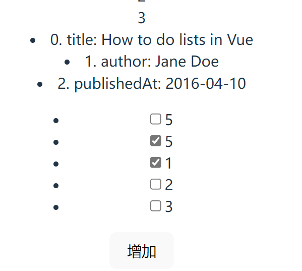

```javascript
  <!-- key:便于vue跟踪每个节点的身份，用于重用和重新排序现有元素 -->
        <!-- key：唯一的标识 -->
        <ul>
            <li v-for="(item,key,index) in person" :key = item>
                <input type="checkbox" name="" id="">{{ item }}
            </li>
        </ul>
        <button @click="addperson">增加</button>
```

### [列表渲染 | Vue.js (vuejs.org)](https://cn.vuejs.org/guide/essentials/list.html#maintaining-state-with-key)

### 数组方法

```javascript
  changeArray(){
            // vue2通过索引修改数组是不会响应式渲染的（vue3中可以）
            // this.testarray.push(1);//末尾添加（...省略多参数）
            // let t = this.testarray.pop();//尾部弹出
            // shift()首位删除
            // unshift()首位添加
            // reverse()翻转

            // splice()
            // （1）删除元素,第一个参数:开始删除或插入的位置下标
            // 第二个参数：要删除的个数，没有则删除后面所有元素
            
            // this.testarray.splice(0,3);
            // (2)插入,第二个参数 = 0
            // this.testarray.splice(1,0,7,8,9,100);
            // 替换元素(1,2,3位替换为7，8，9)
            // this.testarray.splice(1,3,7,8,9);
            // sort()排序,传入函数来设置排序方式
            this.testarray.sort();

        }
```

## 事件处理

```
 addCounter(e){
            // this.counter++;
            //事件对象e
            console.log(e);//点击h2时会传入点击事件
        },
        
        
        
        
<script>
export default {
    data() {
        return {
            counter: 0
        };
    },
    methods: {
        // addCounter(){
        //     this.counter++;
        // },
        addCounter(e) {
            // this.counter++;
            //事件对象e
            console.log(e);//点击h2时会传入点击事件
        },
        plusnumber(num, e) {
            this.counter += num;
            // console.log(e);
        }
    },
}
</script>
<template>
    <div>
        <!-- (1)绑定事件通过函数处理 -->
        <h2 @click="addCounter">{{ counter }}</h2>

        <!-- 绑定事件（2）通过JavaScript代码处理 -->
        <h2 @click="counter++">{{ counter }}</h2>
        <!-- (3) 传递参数 -->
        <h2 @click="plusnumber(10)">{{ counter }}</h2>
        <!-- 既有事件对象（作为实参传入）又传递参数 -->
        <h2 @click="plusnumber(10, $event)">{{ counter }}</h2>
        <!-- 一个点击触发多个函数 ,需要加()，事件参数也要传入-->
        <h2 @click="plusnumber(10, $event), addCounter($event)">{{ counter }}</h2>

    </div>
</template>

```

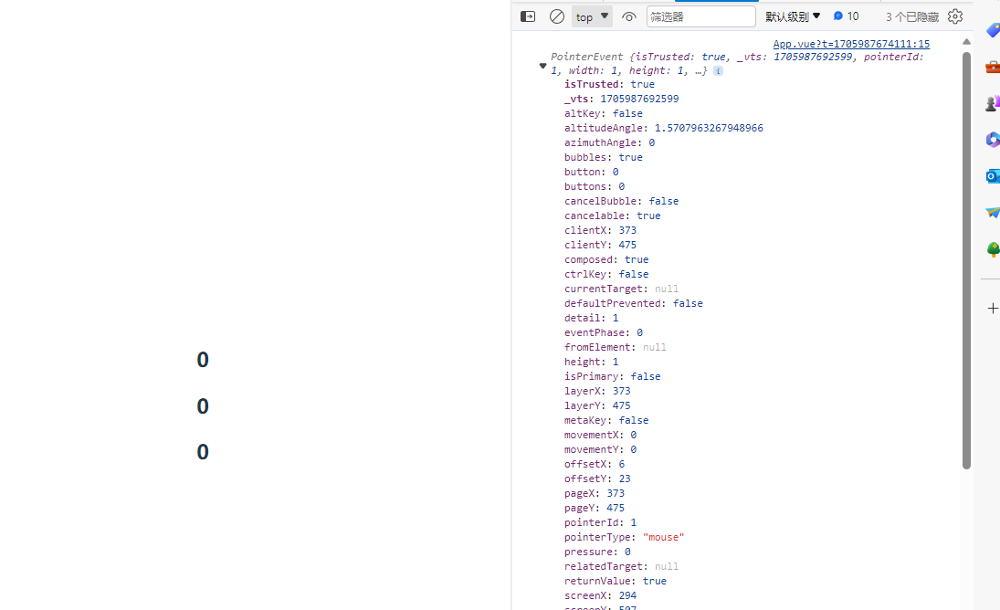


### 事件修饰符

### 事件冒泡,.stop阻止事件冒泡

```javascript
 <!-- 阻止事件冒泡(执行完自身的事件还会执行父元素的事件) .stop-->
        <div @click="divClick">
            <button @click.stop="buttonClick">事件冒泡</button>
        </div>
```

### 阻止默认行为.prevent

```
 <!-- 阻止默认行为(prevent)，下面例子的默认行为是submit点击，form就会提交
        
        表单提交： 当用户点击提交按钮时，表单将提交。
        如果没有指定 action 属性，表单将提交到当前页面的 URL。
        页面刷新： 默认情况下，表单提交后会导致整个页面重新加载。
        这是因为浏览器将执行提交操作，将表单数据发送到服务器，然后接收并处理来自服务器的响应。
        如果没有 JavaScript 干预，页面将按照提交后的响应重新加载。
        
        -->
        <form action="">
            <input type="submit" @click.prevent="submitClick">
        </form>
```

### .once,只触发一次回调

让button只能点击一次，可以用于处理上传文件和人工审核和机器复核操作在同一页面

```javascript
     <!-- .once,只触发一次回调 -->
        
        <button style="background-color:antiquewhite;" @click.once="onceClick">事件冒泡</button>

    
```

## 表单输入绑定

```javascript
<script>
export default {
    data() {
        return {
            msg:"hello",
            checked:true,
            fruit:[],
            sex:'man',
            city:null,
            citys:[]
        }
    },
    methods: {
        change(e){
            this.msg = e.target.value;
        }
    },
}
</script>

<template>
    <div>
<!-- 关联到data中的msg，输入框修改则msg关联修改 双向绑定-->
<!-- 原理：
1. v-bind绑定一个value属性
2. v-on给当前元素添加一个input事件
-->
        <!-- <input type="text" v-model="msg"> -->
        {{ msg }}
<!-- v-bind是单方面的绑定，没有触发input事件 -->
        <input type="text" v-bind:value="msg" @input="change">

        <!-- v-model表单基础用法 -->
        <!-- 复选框 
        为单个时就是boolean值,勾选v-model自动赋值checked为true        
    -->
        <input type="checkbox" v-model="checked">

        {{ checked }}
        <!-- 复选，多个勾选框 -->
        <!-- 绑定value值 ，点击后添加到数组-->
        <input type="checkbox" v-model="fruit" value="苹果">苹果
        <input type="checkbox" v-model="fruit" value="香蕉">香蕉
        <input type="checkbox" v-model="fruit" value="火龙果">火龙果
        <h1>喜欢的水果：{{ fruit }}</h1>

        <!-- 单选radio 
        javascript:加name='sex'
        -->
        <input type="radio" v-model="sex" value="man">man
        <input type="radio" v-model="sex" value="woman">woman
        <h1>{{ sex }}</h1>
        <!-- 下拉选项，选中某个后将其value值赋值给v-model绑定的变量
        可以在data中给默认值 -->
        <select name="" id="" v-model="city">
            <option value="">--Please choose an option--</option>
            <option value="new york">new york</option>
            <option value="tokyo">tokyo</option>
        </select>
        <h1>{{ city }}</h1>
        <!-- 多选 -->
        <select name="" id="" v-model="citys" multiple>
            <option value="">--Please choose an option--</option>
            <option value="new york">new york</option>
            <option value="tokyo">tokyo</option>
        </select>
        <h1>{{ citys }}</h1>
</div>
</template>

```

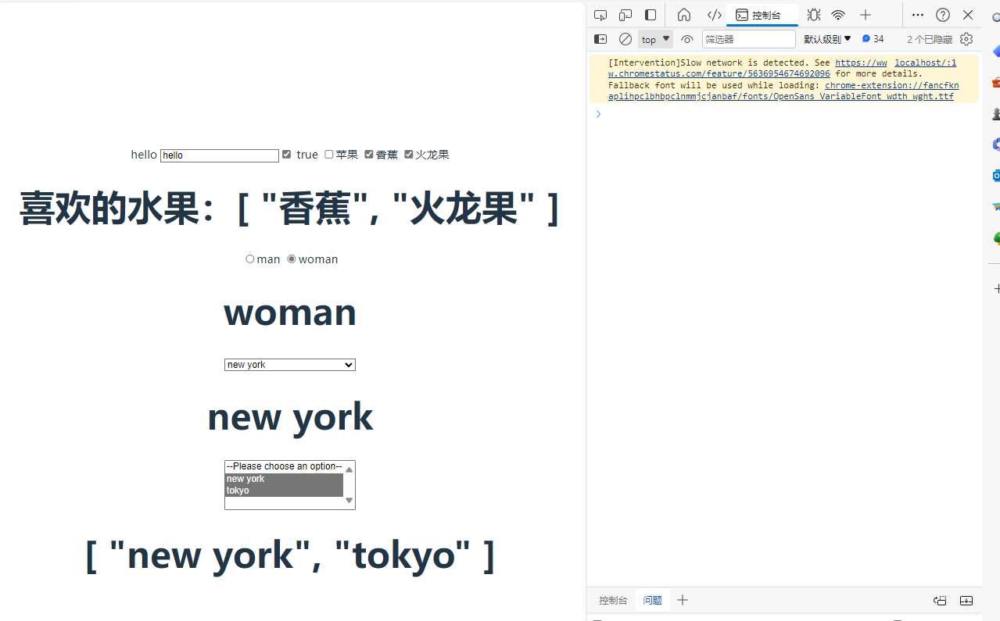

### 值绑定

```
  <!-- 值绑定 -->
        <select name="" id="" v-model="citys2" multiple>
            <option value="">--Please choose an option--</option>
            <option :value="test">{{ test }}</option>
        </select>
        <h1>{{ citys2 }}</h1>
        <button @click="changecity">改变多选中的城市</button>

```

将该值绑定到当前组件实例上的动态数据。这可以通过使用 `v-bind` 来实现。此外，使用 `v-bind` 还使我们可以将选项值绑定为非字符串的数据类型

### 修饰符

#### .lazy


#### `.number`

自动将用户的输入转换为数值类型

**人工审核时作用比较大，用于限制用户输入和在前端就将输入规范**


```
            age:null

<!-- .number -->
        <input v-model.number="age" type="text">
        {{ age }}
```

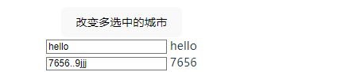

#### `.trim`

默认自动去除用户输入内容中两端的空格， `v-model` 后添加 `.trim` 修饰符

```
        <input v-model.trim="msg" />
```


## 组件化开发

页面各个部分分成若干组件

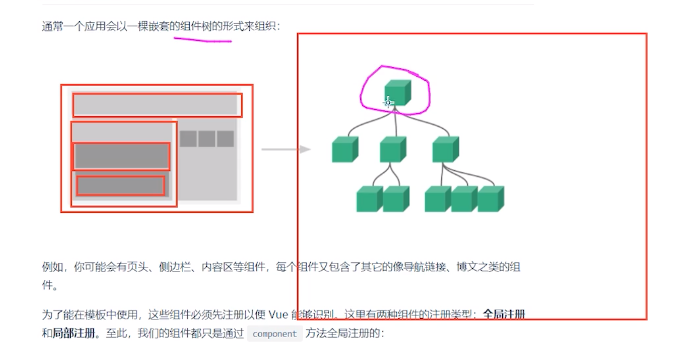

```vue
<template>
<div>
    <h1>Content组件的内容</h1>
    <!-- 如何展示（main.js挂载的是App.vue，使用到index.html的id = 'app'控件上） -->
</div>
</template>
```

```vue
<script>
// 引入组件(vue2方式)
import Content from './components/Content.vue'
export default {
    components: {
        Content,
    },
    data() {
        return {

        }
    },
    methods: {

    },
}
</script>

<template>
    <!-- 在template中使用组件展示Content -->
    <div>
        <Content></Content>
    </div>
</template>
```

在template中使用组件展示Content（使用html标签）

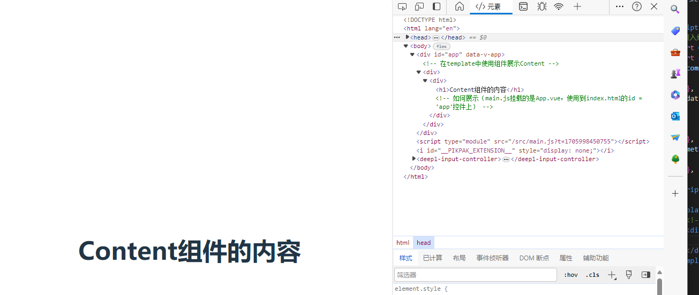

将hello组件展示到content组件中：

```vue
<template>
<div>
    <h1>Content组件的内容</h1>
    <!-- 如何展示（main.js挂载的是App.vue，使用到index.html的id = 'app'控件上） -->
    <Hello></Hello>
</div>
</template>
<!-- 将hello组件展示在content组件中 -->
<script>
import Hello from './Hello.vue'

export default{
// 注册组件才能使用
    components:{
        Hello
    }
}
</script>
```

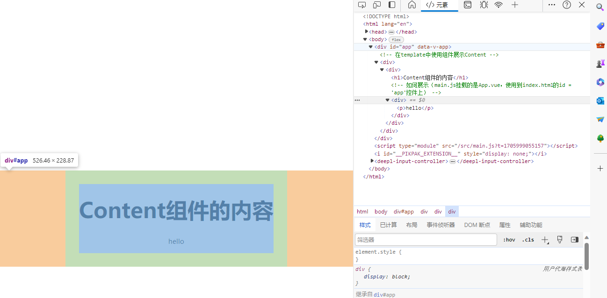

**这样可以实现组件的复用**

根组件：APP

父组件：Content，其子组件：Hello

## 组件数据存放

Content虽然是App的子组件，但是无法拿到App中的data{ return{}; }数据

### data为什么是函数

data在每个组件对象中返回的是一个新的对象

所以组件复用时数据不会互相干扰

如果返回的是全局定义的const obj则会互相干扰

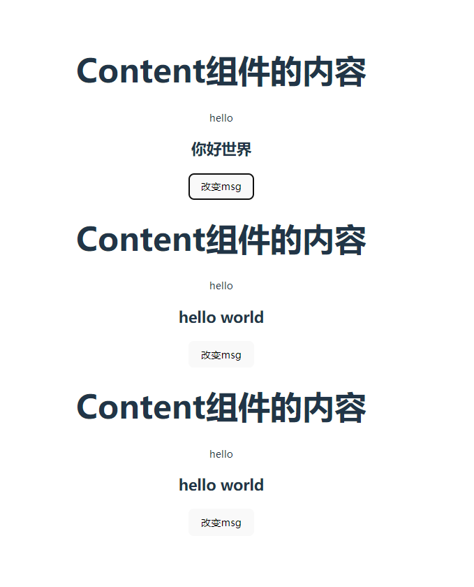

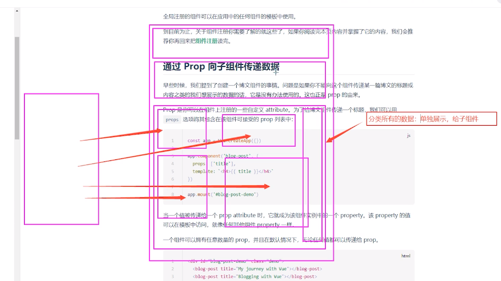

## prop向子组件传递数据

将Content中的数据传递给Hello

```
      <!-- 静态值可以直接传入 -->
  <Hello :message="msg" aaa="123"></Hello>

```

Hello中：

```
<template>
    <div>
        <p>hello</p>
        <h2>{{ message }}</h2>
    </div>
</template>
<script>
    export default{
        // 在组件的 props 列表上声明要传来的属性的名字
        props:['message','aaa']
    }
</script>
```

这样在父组件中可以先获取后端返回值，然后根据组件需求分配到各个子组件 

### prop类型

可以为每个prop指定值类型，用对象形式列出prop

```
 <!-- aaa传入数字需要:(v-bind) -->
    <Hello :message="msg" :aaa='123'></Hello>
```

设置类型，设置默认值

```javascript
// 在组件的 props 列表上声明要传来的属性的名字
        // props:['message','aaa']
        // props类型限制
        props:{
            message:{
                type:String,
                default:"okok",
                required:true//必须传入
            },
            aaa:Number,
        }
```


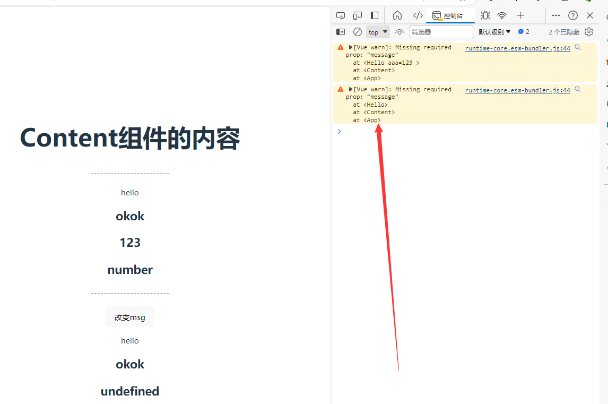

```javascript
 //接收传入的数组,默认值略有不同,对象和数字的默认值需要一个函数来返回
            list:{
                type:Array,
                default(){
                    return []
                }
            }
```

所有的 props 都遵循着**单向绑定**原则，props 因父组件的更新而变化，自然地将新的状态向下流往子组件，而不会逆向传递。这避免了子组件意外修改父组件的状态的情况，不然应用的数据流将很容易变得混乱而难以理解。

**另外，每次父组件更新后，所有的子组件中的 props 都会被更新到最新值，这意味着你不应该在子组件中去更改一个 prop。若你这么做了，Vue 会在控制台上向你抛出警告**

## 子组件向父组件传递数据

### 监听子组件事件

App如何拿到Content的数据：通过自定义事件

在Content中：

```
    <button @click="sendToApp">提交Content组件数据到App组件</button>

```

```
sendToApp(){
            // 触发自定义事件，通过$emit来触发事件
            // this.$emit('自定义的事件的名称','发送的事件参数')
            this.$emit('injectMsg',this.msg);

        }
```

在父组件App中：

```javascript
<script>
import Content from './components/Content.vue'
export default {
    components: {
        Content,
    },
    data() {
        return {}
    },
    methods: {
        getContentMsg(value){
            //此函数的默认参数即为
            // 子组件传来的数据
            console.log(value);
        }
    },
}
</script>
<template>
    <!-- 在template中使用组件展示Content -->
    <div>
        <!-- 子组件中点击按钮触发了injectMsg事件，触发父组件中的getContentMsg函数 -->
        <Content @injectMsg="getContentMsg"></Content>
        <!-- <Content></Content> -->
        <!-- <Content></Content> -->
        <!-- 通过v-on监听子组件中的自定义事件 -->
    </div>
</template>
```

## 父子组件访问

### $refs（vue2） 父组件访问子组件（重要）

**为子组件或元素注册引用信息**

$children在vue3已经不支持

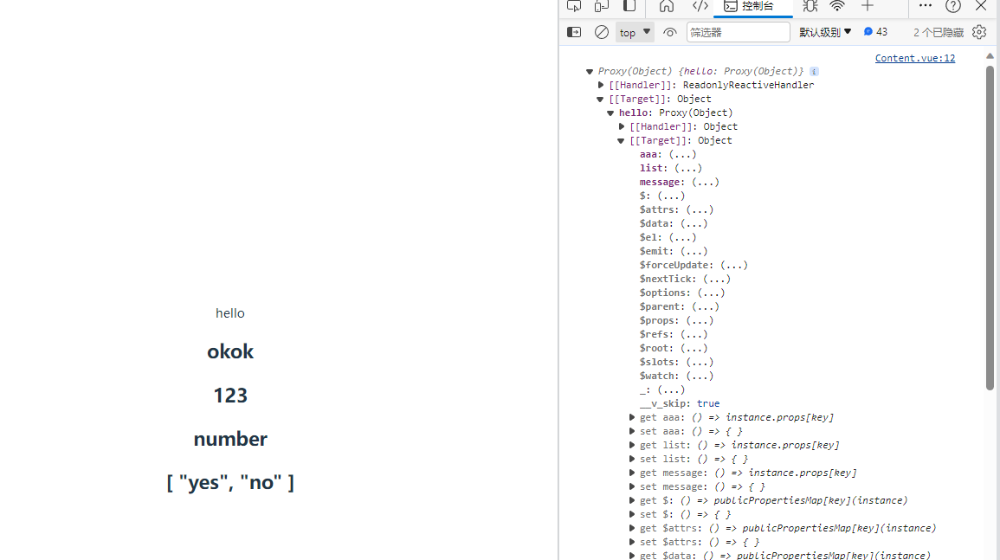

子组件通过props获取到的数据也算是子组件的数据所以访问子组件的时候也可以访问到这些数据，还有子组件中data的数据

```
    <!-- 使用ref为组件绑定特定的id(控件上也可以使用) -->
        <Hello :aaa='123' :list="list" ref="hello"></Hello>
```

```
mounted(){
            console.log(this.$refs.hello.aaa);
        },
```

也可以执行子组件中的方法

**也可以拿到控件滚动的距离和id，class等**

### 子组件访问父组件 $parent

不需要注册，可以直接在子组件中访问

**尽量不用这个方法来获取父组件的值（组件复用性很高），父组件是谁有时比较复杂**

```javascript
 mounted(){
            // 子组件先执行
            console.log(this.$parent);
            console.log(this.$root);
        }
    }
```

### 子组件访问跟组件 $root

根组件只有一个

## 插槽 slot

应用中几乎每个页面的导航栏样式布局都大致相同

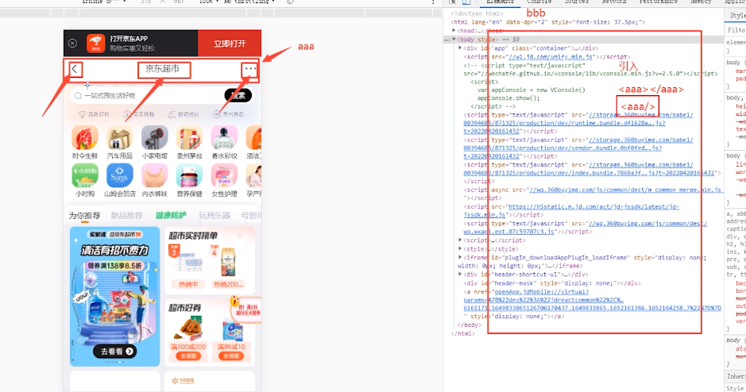

页面组件b中引入导航栏组件a，a中三个导航为空，需要根据情况填写

```
<template>
    <div>
        <h2>content组件内容</h2>
        <div>
            <slot></slot>
        </div>
    </div>
</template>
```

```
        <Content><button>按钮</button></Content>

```

多个值可以直接多个一起替换

### 多插槽（具名插槽）

要为具名插槽传入内容，需要使用一个含 `v-slot` 指令的 `<template>` 元素，并将目标插槽的名字传给该指令：

template

```vue
  <template v-slot:header>
    <!-- header 插槽的内容放这里 -->
  </template>
```

虽然替换了过来但是作用域还是在原组件内

**渲染作用域：**

**[插槽 Slots | Vue.js (vuejs.org)](https://cn.vuejs.org/guide/components/slots.html#render-scope)**

### 插槽默认值

```
<button type="submit">
  <slot>
    Submit <!-- 默认内容 -->
  </slot>
</button>
```

### 作用域插槽

例如：子组件展示一个列表，但是这个列表的内容样式确由父组件决定，这种情况下父组件可能需要获取子组件此列表的内容

```
<!-- (1)子组件通过v-bind绑定list -->
            <slot :list="list"></slot>
```

接收：

```
<Content>
            <template v-slot="slotProps">{{ slotProps.list }}</template>
        </Content>
```

```
 <!-- 无序列表 -->
        <Content>
            <!-- 结合v-for -->
            <template v-slot:default="slotProps">
                <ul>
                    <li v-for="item in slotProps.list" :key="item">
                        {{ item }}
                    </li>
                </ul>
            </template>
        </Content>
        <!-- 有序列表 -->
        <Content>
            <!-- 结合v-for -->
            <template v-slot:default="slotProps">
                <ol>
                    <li v-for="item in slotProps.list" :key="item">
                        {{ item }}
                    </li>
                </ol>
            </template>

        </Content>

```

## provide,inject，跨级通信

例如：HomeView作为祖先组件，Hello作为最下级组件，Content为中间组件

现在想要在Hello中拿到HomeView中的数据


